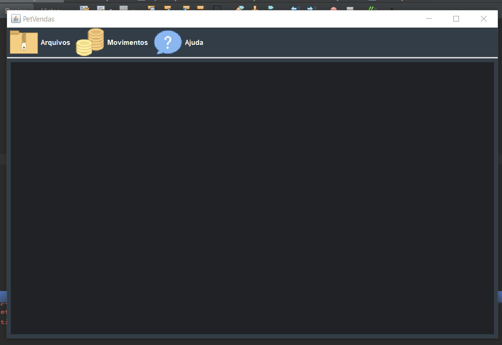
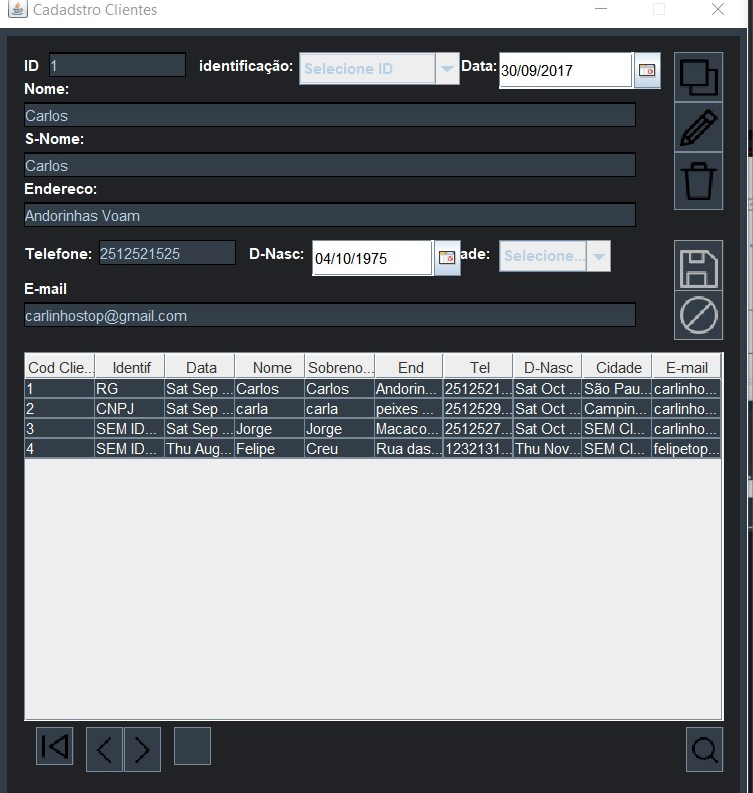
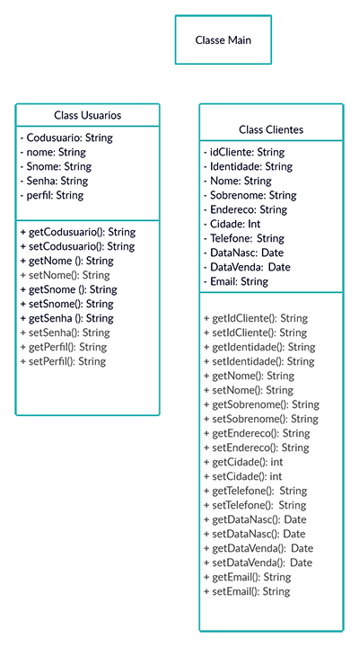
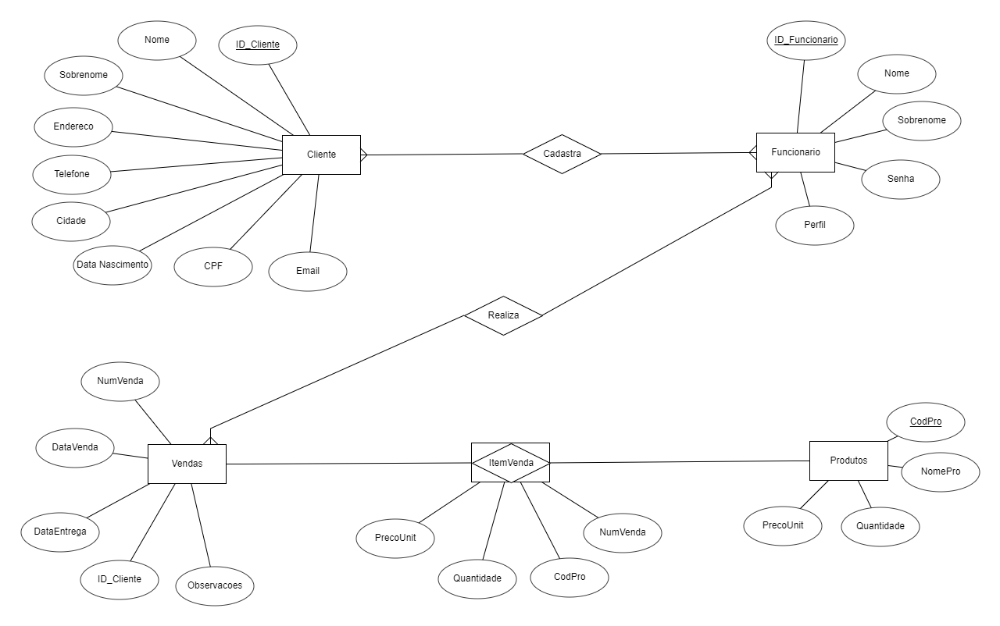

# Sistema de vendas em Java.

   

<h3 align="center">
  Onde as patas estão em boas mãos!
</h3>

----

 <a href="#sobre">Sobre</a> •
 <a href="#funcionalidades">Funcionalidades</a> •
 <a href="#screenshots">Screenshots</a> •
 <a href="#diagramas">Diagramas</a> • 
 <a href="#equipe">Equipe</a>

<h2 id="sobre">:heavy_check_mark: Sobre</h2>

Objetivo do Sistema: Nesse sistema os funcionários poderão cadastrar clientes e realizar vendas. Tais vendas serão salvas no banco de dados.
 

Seguindo a ideia do PetHelper (Projeto de Fábrica de Projetos), o PetVendas é direcionado a donos de Pets, logo os produtos seriam relacionados a eles.

----

<h2 id="funcionalidades">:gear: Funcionalidades</h2>

- [x] Cadastro de usuário
- [x] Cadastro de cliente
- [ ] Cadastro de produtos

----

<h2 id="screenshots">:iphone: ScreenShots</h2>

- Tela de Início 

- Tela de Cadastro

----

<h2 id="diagramas">:memo: Diagramas</h2>
<h3>Diagrama de Classes:</h3>

   

<h3>Diagrama Entidade Relacionamento:</h3>

   

----

<h2 id="equipe">:construction_worker: Equipe</h2>

- Carlos Eduardo de Lima - RA: 200072
- Eduardo Murillo de Oliveira - RA: 200332
- Gabriel Andrade Corrêa - RA: 200380
- Marcelo Correia Lima - RA: 190257
- Matheus Thommesani Marcelino Morais - RA: 200239
- Rômulo Augusto - RA: 200931
