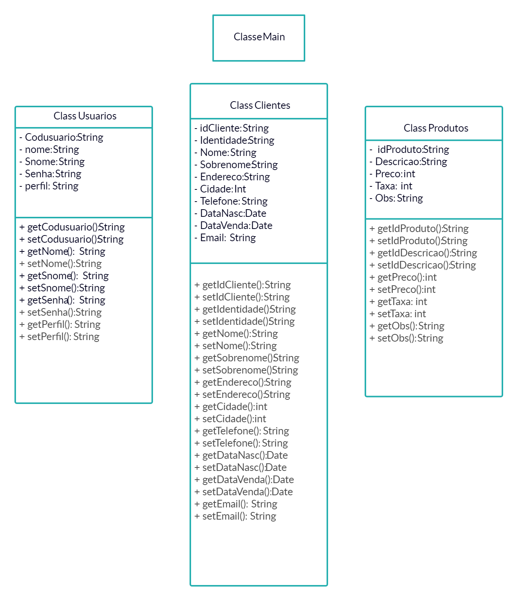

<h1>Projeto de um Sistema de vendas em Java.</h1> 
<h2>:convenience_store: Loja</h2>

Nome da loja: <b>PetVendas</b> 
Logo da Empresa: 

<h2>:construction_worker: Equipe</h2>

Carlos Eduardo de Lima - RA: 200072

Eduardo Murillo de Oliveira - RA: 200332

Gabriel Andrade Corrêa - RA: 200380

Marcelo Correia Lima - RA: 190257

Matheus Thommesani Marcelino Morais - RA: 200239

Rômulo Augusto - RA: 200931

<h2>:memo: Diagramas</h2>
Diagrama de Classes: 

Diagrama Entidade Relacionamento: 

<h2>:heavy_check_mark: Objetivos</h2>

Objetivo do Sistema: Nesse sistema os funcionários poderão cadastrar clientes e realizar vendas. Tais vendas serão salvas no banco de dados.
 

Seguindo a ideia do PetHelper (Projeto de Fábrica de Projetos), o PetVendas é direcionado a donos de Pets, logos os produtos seriam relacionados a eles.

